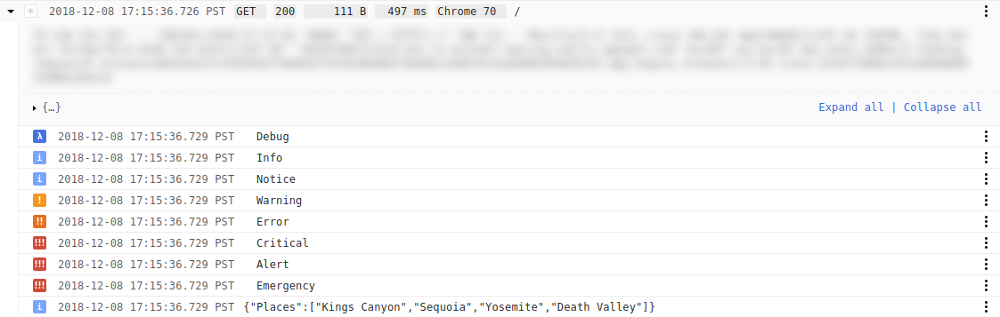

# Easy Stackdriver Logging on Google App Engine Standard second generation runtimes

[](https://godoc.org/github.com/mtraver/gaelog)
[](https://goreportcard.com/report/github.com/mtraver/gaelog)

Using Stackdriver Logging on App Engine Standard is complicated. It doesn't
have to be that way.

```go
package main

import (
  "fmt"
  "log"
  "net/http"
  "os"

  "github.com/mtraver/gaelog"
)

// wrappedHandler must be wrapped using gaelog.Wrap or gaelog.WrapWithID so that the
// request context can be used with the package-level logging functions.
type wrappedHandler struct{}

func (h wrappedHandler) ServeHTTP(w http.ResponseWriter, r *http.Request) {
  if r.URL.Path != "/" {
    http.NotFound(w, r)
    return
  }

  ctx := r.Context()

  gaelog.Debugf(ctx, "Debug")
  gaelog.Infof(ctx, "Info")
  gaelog.Noticef(ctx, "Notice")
  gaelog.Warningf(ctx, "Warning")
  gaelog.Errorf(ctx, "Error")
  gaelog.Criticalf(ctx, "Critical")
  gaelog.Alertf(ctx, "Alert")
  gaelog.Emergencyf(ctx, "Emergency")

  message := struct {
    Places []string
  }{
    []string{"Kings Canyon", "Sequoia", "Yosemite", "Death Valley"},
  }

  gaelog.Info(ctx, message)

  fmt.Fprintf(w, "Hello!")
}

// manualHandler creates and closes a logger manually. This usage does not require
// gaelog.Wrap or gaelog.WrapWithID.
func manualHandler(w http.ResponseWriter, r *http.Request) {
  lg, err := gaelog.New(r)
  if err != nil {
    // The returned logger is valid despite the error. It falls back to logging
    // via the standard library's "log" package.
    lg.Errorf("Failed to make logger: %v", err)
  }
  defer lg.Close()

  lg.Warningf("Some important info right here, that's for sure")

  fmt.Fprintf(w, "Hello!")
}

func main() {
  // Wrap the handler.
  http.Handle("/", gaelog.Wrap(wrappedHandler{}))

  http.HandleFunc("/manual", manualHandler)

  port := os.Getenv("PORT")
  if port == "" {
    port = "8080"
  }
  log.Fatal(http.ListenAndServe(fmt.Sprintf(":%s", port), nil))
}
```



## Known issues

1. **Request log (aka parent) severity is not set.**
A nice property of `google.golang.org/appengine/log` is that the severity of the request log entry (aka
parent entry) is set to the maximum severity of the log entries correlated with it. This makes it easy
to see in the Stackdriver UI which requests have logs associated with them, and at which severity. Alas, that
is not possible with this package. App Engine itself makes the request log entries and it does not know about
any correlated entries created separately (such as with this package). Furthermore, entries cannot be modified
after they are created. A possible remedy is for this package to emit request log entries of its own; open an
issue if you'd like this and we can discuss.

1. **If a request has any log entries made by `google.golang.org/appengine/log` or App Engine itself,
then entries made by this package will not be correlated (i.e. nested) with the request in the Stackdriver
Logging UI.**
Such logs are "embedded" logs—if you expand the request log entry you'll see the other log lines embedded
there in the data structure. Embedded and correlated logs do not play nicely together. An annoying consequence
is that requests that start a new instance or that time out will not be correlated with logs emitted via this
package because App Engine adds embedded logs on such requests. This issue is not solvable in this package.
